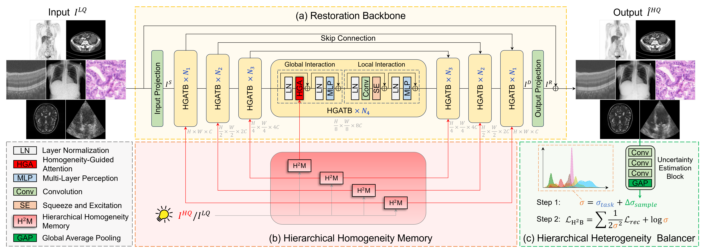
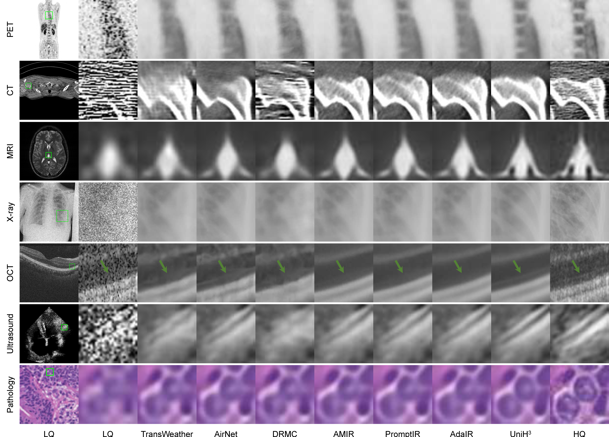

# UniH<sup>3</sup>: Unifying Hierarchical Homogeneity and Heterogeneity for All-in-One Medical Image Restoration

PyTorch implementation for UniH<sup>3</sup>: Unifying Hierarchical Homogeneity and Heterogeneity for All-in-One Medical Image Restoration[](https://arxiv.org/abs/2609.11156)

:rocket::rocket::rocket:Check our paper collection of recent **Awsome-Medical-Image-Restoration** [](https://github.com/Yaziwel/Awesome-Medical-Image-Restoration)

## Network Architecture



## Visualization



## Dataset

We are currently working on this and plan to make the data publicly available in September 2026.

## Citation

If you find UniH$^3$ useful in your research, please consider citing:

```bibtex
@inproceedings{yang2026UniH3,
      title={UniH$^3$: Unifying Hierarchical Homogeneity and Heterogeneity for All-in-One Medical Image Restoration}, 
      author={Zhiwen Yang and Jiayin Li and Chengyu Liu and Hui Zhang and Bingzheng Wei and Yan Xu},
      booktitle={European Conference on Computer Vision},
      year={2026},
}
```
